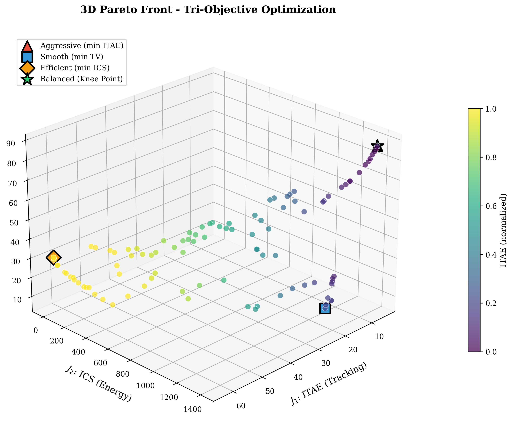
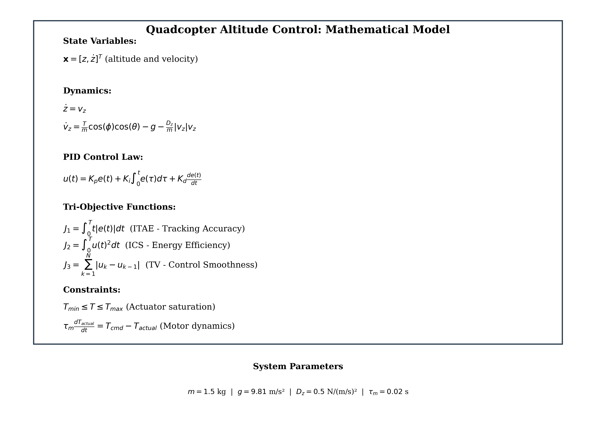
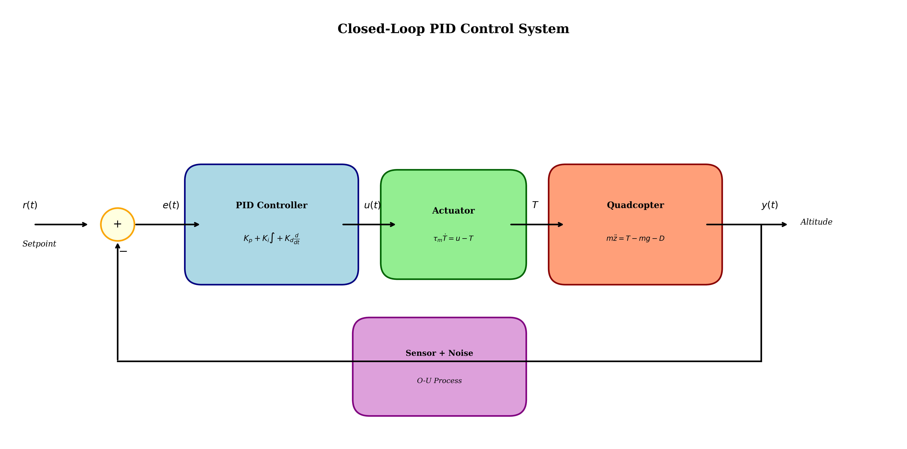
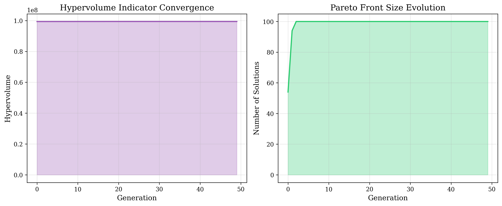
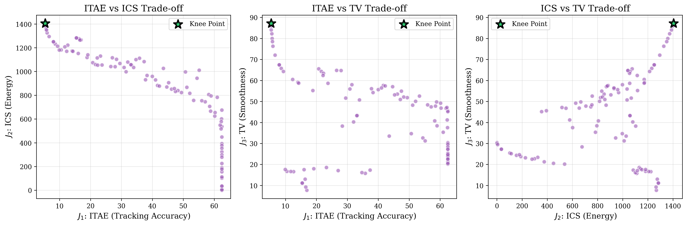
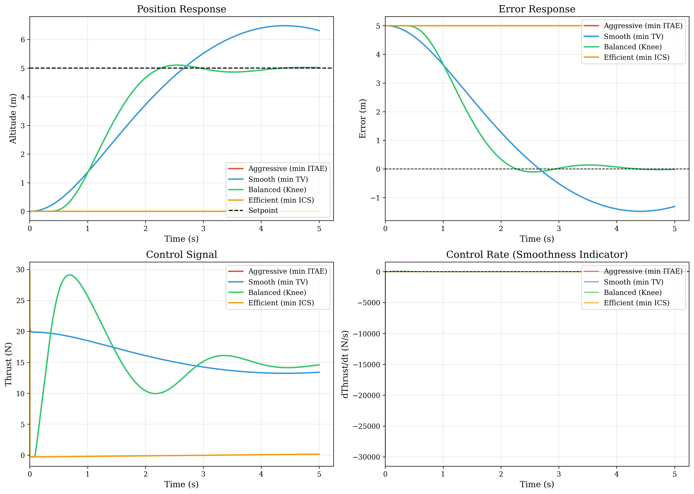
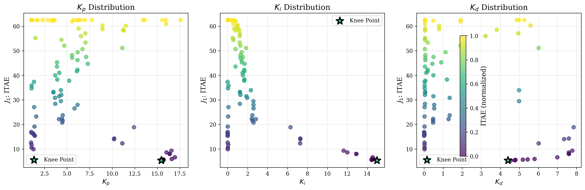
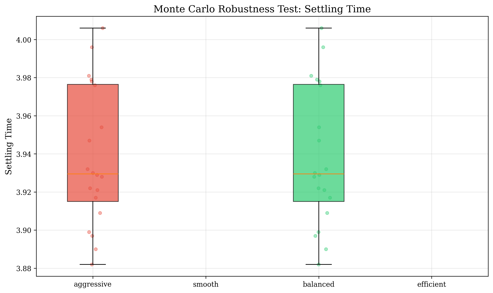
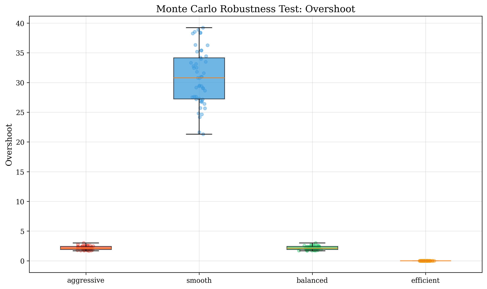
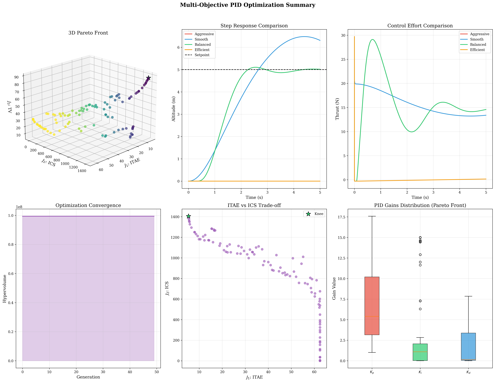

# Multi-Objective Neuro-Evolutionary PID Tuning for High-Dynamic Systems

<p align="center">
  
</p>

##  Project Overview

This project implements a **Tri-Objective Pareto-Optimal PID Controller** for high-dynamic systems, demonstrated on a 6-DOF quadcopter altitude control simulation. Unlike conventional PID tuning methods (Ziegler-Nichols, Cohen-Coon) that optimize for a single objective, this framework uses **NSGA-II** (Non-dominated Sorting Genetic Algorithm II) to find the complete trade-off surface between three conflicting objectives.

### Why Multi-Objective Optimization?

Traditional single-objective tuning often leads to:
-  Aggressive control signals that saturate actuators
-  Mechanical fatigue from high-frequency control variations
-  Excessive energy consumption
-  Poor robustness to parameter variations

Our tri-objective approach provides:
-  A complete Pareto front of optimal solutions
-  Explicit trade-offs between performance, energy, and smoothness
-  Designer freedom to select the best compromise
-  Robust solutions verified through Monte Carlo testing

---

##  The Three Objectives

<p align="center">
  
</p>

### Objective 1: Tracking Accuracy (ITAE)
**Integral of Time-weighted Absolute Error**

$$J_1 = \int_{0}^{T} t |e(t)| dt$$

- Penalizes errors that persist over time
- Encourages fast settling and minimal steady-state error
- **Goal:** Minimize settling time and overshoot

### Objective 2: Energy Efficiency (ICS)
**Integral of Control Squared**

$$J_2 = \int_{0}^{T} u(t)^2 dt$$

- Measures total control energy expenditure
- Directly relates to battery life and motor heating
- **Goal:** Maximize actuator lifespan

### Objective 3: Control Smoothness (TV)
**Total Variation of Control Signal**

$$J_3 = \sum_{k} |u_{k} - u_{k-1}|$$

- Quantifies high-frequency "jitter" in control
- Reduces derivative kick and mechanical stress
- **Goal:** Protect mechanical linkages

---

##  System Model: Quadcopter Altitude Control

<p align="center">
  
</p>

### State-Space Dynamics

The quadcopter altitude dynamics are modeled as:

$$\dot{z} = v_z$$

$$\dot{v}_z = \frac{T}{m}\cos(\phi)\cos(\theta) - g - \frac{D_z}{m}|v_z|v_z$$

Where:
- $z$ = altitude, $v_z$ = vertical velocity
- $T$ = total thrust from motors
- $m = 1.5$ kg = quadcopter mass
- $g = 9.81$ m/s² = gravity
- $D_z = 0.5$ N/(m/s)² = vertical drag coefficient

### Simulation Features

- **Actuator Saturation:** PWM clipping and thrust limits
- **Motor Dynamics:** First-order lag ($\tau_m = 0.02$ s)
- **Sensor Noise:** Ornstein-Uhlenbeck process for realistic drift
- **Time Step:** $\Delta t = 1$ ms for real-time compatibility

---

##  NSGA-II Optimization Algorithm

### Population Initialization
**Latin Hypercube Sampling (LHS)** ensures better coverage of the search space compared to random initialization.

### Genetic Operators
| Operator | Method | Parameter |
|----------|--------|-----------|
| Crossover | Simulated Binary Crossover (SBX) | $\eta_c = 15$ |
| Mutation | Polynomial Mutation | $\eta_m = 20$ |
| Selection | Binary Tournament + Crowding Distance | - |

### Convergence Tracking
The **Hypervolume Indicator** measures the volume of objective space dominated by the Pareto front.

<p align="center">
  
</p>

---

##  Results & Visualization

### 3D Pareto Front Surface

The complete trade-off surface between all three objectives:

<p align="center">
  
</p>

### 2D Trade-off Projections

<p align="center">
  
</p>

### Selected Solutions Comparison

| Solution | Description | ITAE | ICS | TV |
|----------|-------------|------|-----|-----|
|  **Aggressive** | Minimum ITAE | Low | High | High |
|  **Smooth** | Minimum TV | High | Medium | Low |
|  **Efficient** | Minimum ICS | High | Low | Medium |
|  **Balanced** | Knee Point | Medium | Medium | Medium |

### Time-Domain Response Comparison

<p align="center">
  
</p>

**Key observations:**
- **Aggressive tune:** Fastest rise time but highest overshoot and control effort
- **Smooth tune:** Gentlest control signal but slowest response
- **Balanced (Knee):** Best overall compromise for most applications

### PID Gains Distribution

<p align="center">
  
</p>

---

##  Monte Carlo Robustness Testing

The top Pareto solutions are tested against:
- **Mass variation:** ±20%
- **Drag coefficient variation:** ±30%
- **Sensor noise:** Ornstein-Uhlenbeck process

<p align="center">
  
</p>

<p align="center">
  
</p>

---

##  Comprehensive Summary

<p align="center">
  
</p>

---

## 🛠️ Installation & Usage

### Prerequisites
- Python 3.12+
- uv (recommended) or pip

### Quick Start

```bash
# Clone repository
git clone https://github.com/yourusername/pid-optimization.git
cd pid-optimization

# Install dependencies with uv
uv sync

# Run optimization
uv run python main.py
```

### With pip

```bash
pip install -e .
python main.py
```

### Output

The script generates:
- `figures/pareto_front_3d.png` - 3D Pareto surface
- `figures/pareto_projections.png` - 2D trade-off views
- `figures/time_domain_comparison.png` - Step response comparison
- `figures/convergence.png` - Optimization convergence
- `figures/monte_carlo_*.png` - Robustness analysis
- `figures/differential_equations.png` - Mathematical model
- `figures/system_block_diagram.png` - Control block diagram
- `figures/optimization_summary.png` - Comprehensive summary
- `figures/optimization_results.json` - Numerical results

---

##  Project Structure

```
pid/
├── main.py                 # Main optimization pipeline
├── pyproject.toml          # Project configuration
├── README.md               # This file
├── figures/                # Generated visualizations
│   ├── pareto_front_3d.png
│   ├── time_domain_comparison.png
│   └── ...
└── src/
    ├── __init__.py         # Package initialization
    ├── quadcopter.py       # 6-DOF quadcopter dynamics
    ├── pid_controller.py   # Industrial PID with anti-windup
    ├── nsga2.py            # NSGA-II optimizer
    ├── objectives.py       # ITAE, ICS, TV metrics
    └── visualization.py    # Publication-quality plots
```

---

##  Technical Details

### PID Controller Features

- **Derivative filtering:** Low-pass filter on D-term
- **Anti-windup:** Back-calculation method
- **Derivative on measurement:** Prevents derivative kick
- **Output saturation:** Prevents actuator damage

### Search Space

| Parameter | Min | Max | Unit |
|-----------|-----|-----|------|
| $K_p$ | 1.0 | 40.0 | N/m |
| $K_i$ | 0.0 | 15.0 | N/(m·s) |
| $K_d$ | 0.0 | 8.0 | N·s/m |

---

##  References

1. Deb, K., et al. "A fast and elitist multiobjective genetic algorithm: NSGA-II." *IEEE Trans. Evolutionary Computation* (2002).
2. Åström, K.J., & Hägglund, T. "PID Controllers: Theory, Design and Tuning." *ISA* (1995).
3. Coello, C.A.C., et al. "Evolutionary Algorithms for Solving Multi-Objective Problems." *Springer* (2007).